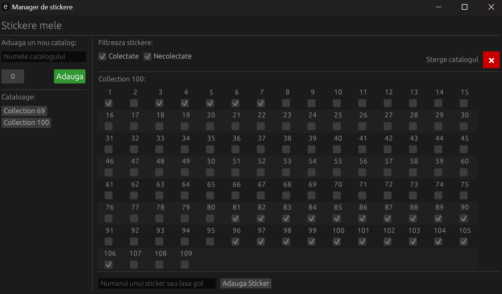

# Sticker Management Application



## Overview

The Sticker Management Application is designed to help users manage their collectible cards efficiently.
It provides a user-friendly interface for adding, viewing, and organizing collections and individual cards.
The application leverages the `eframe` and `egui` libraries for the UI and `rusqlite` for database operations.

## Features

### Collection Management

- **Add New Collections:** Users can add new collections by specifying the collection name and size.
  The application will automatically populate the collection with cards numbered between 1 and the size of collection.
- **View Collection:** All collections are displayed in a list, allowing users to easily browse through their
  collections.
- **Delete Collections:** Users can delete collections, which also removes all associated cards.

### Card Management

- **View Cards:** Users can view all cards within a selected collection.
- **Filter Cards:** Users can filter cards based on their collected status (collected or not collected).
- **Add Cards:** Users can add new cards to a collection. If no number is specified for the card's label it will be
  automatically inferred to be the next consecutive card in the collection.
- **Update Card Status:** Users can update the collected status of individual cards.
- **Manage Duplicates:** Users can view and update the number of duplicates for each card.

## User Interface

- **Popup Notifications:** The application provides popup notifications for various actions, such as adding or deleting
  collections.
- **Responsive Layout:** The UI is designed to be responsive, ensuring a smooth user experience across different screen
  sizes.

## Getting started

### Prerequisites

- Rust and Cargo installed on your system.

### Installation

1. Clone the repository:

```bash
git clone https://github.com/AndreyVLD/stickere.git
```

2. Navigate to the project directory:

```bash
cd stickere
```

3. Build the project:

```bash
cargo build
```

### Running the Application

To run the application, use the following command:

```bash
cargo run 
```
